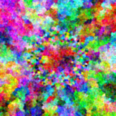

# Algorithmic Art

This project was inspired by a video from Corridor Crew; [I Made Art That HACKS Your Eyes](https://www.youtube.com/watch?v=SxsN6FRXMWQ)

A simple web application that generates beautiful algorithmic art using space-filling curves and mathematical patterns. Create, customize, and download unique digital artwork.



## Features

- Generate unique art patterns with various algorithms
- Customize colors, patterns, and complexity
- Download as PNG or PDF
- Save designs to your local gallery
- Mobile-friendly interface

## Getting Started

### Prerequisites

- Node.js 16+
- npm or yarn

### Installation

1. Clone the repository
   ```
   git clone https://github.com/yourusername/algorithmic-art-gallery.git
   cd Art-Gallery
   ```

2. Install dependencies
   ```
   npm install
   ```

3. Start the development server
   ```
   npm run dev
   ```

4. Open your browser and navigate to `http://localhost:4321`

### Building for Production

To create a production build:

```
npm run build
```

The build files will be in the `dist` directory, ready to be deployed to any static hosting service.

## Technologies

- [Astro](https://astro.build/) - Web framework
- [React](https://reactjs.org/) - UI components
- [TailwindCSS](https://tailwindcss.com/) - Styling
- Web Workers - For performance-intensive calculations
- LocalStorage - For saving user creations

## License

[MIT](LICENSE)

```sh
npm create astro@latest -- --template basics
```
